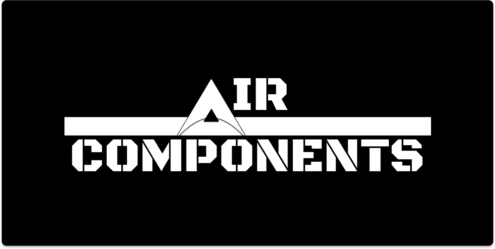

## Hi there! 👋 Welcome to my GitHub profile!

[中文](https://github.com/SisyphusZheng/SisyphusZheng/blob/main/README_CN.md)

I'm **ZhiZheng**, a passionate developer and design engineer with a strong focus on building modern and innovative solutions.

### 🌱 Tech Stack

  
### 🎓 Education

- **Master's Degree in Software Engineering** from **University of Limerick, Ireland**.  

- Currently holding a **provisional offer for a PhD** in AI.  

### 💼 Looking for opportunities

- Actively seeking roles as a **Frontend Developer**, **Web Developer**, or **Full-Stack Developer** where I can contribute to innovative projects and grow my expertise in modern web technologies.  

### 📫 How to reach me

- **Email**: [freemanzheng@hotmail.com](freemanzheng@hotmail.com)

### 🌟 Featured Projects

- [Air Components](https://github.com/SisyphusZheng/air-components):A minimalist web component library designed for seamless integration and modern design. 

  You can search for aircomponents on Google, and the link that comes up first is the one you want: 

[aircomponents.org](https://aircomponents.org)

  

### 🌐 Community Contributions

- **CSDN Community Contributions**: Engaged with a 2k+ follower base and achieved 300k+ reads, with six blog posts featured in communities like 松山湖开发者村 and 开放原子基金会

### 📊 GitHub Stats

    

Feel free to explore my repositories and drop a ⭐ if you like what you see!
