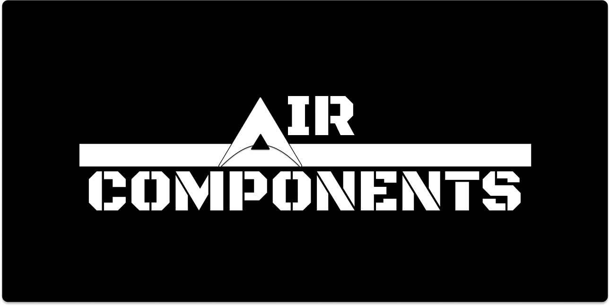

## Hi there! 👋 Welcome to my GitHub profile!

我是 **郑治**，一名充满热情的开发者与设计工程师，专注于构建现代化与创新型的解决方案。

### 🌱 技术栈

### 🎓 教育背景

- **爱尔兰利默里克大学** 软件工程硕士

- 目前获得了AI博士的拟录取资格。

### 💼 正在找工作

我正在积极寻找 **前端开发工程师**、**Web 开发工程师** 或 **全栈开发工程师** 的职位，希望能够为创新项目做出贡献并在现代 Web 技术领域不断精进。

### 📫 联系方式

- **Email**: [freemanzheng@hotmail.com](freemanzheng@hotmail.com)  

### 🌟 Featured Projects

- [Air Components](https://github.com/SisyphusZheng/air-components)：一个极简风格的网页组件库，旨在实现无缝集成和现代设计。 

 您可以在谷歌上搜索aircomponents，第一个出现的链接就是我的项目：

[aircomponents.org](https://aircomponents.org)

  

### 🌐 社区贡献

- **CSDN 社区贡献**：在 CSDN 社区积累了 2k+ 粉丝，300k+ 阅读量，六篇博文被松山湖开发者村和开放原子基金会等社区收录。

### 📊 GitHub 统计

    

#### 欢迎探索我的代码库，如果你喜欢，请记得点 ⭐ 支持
